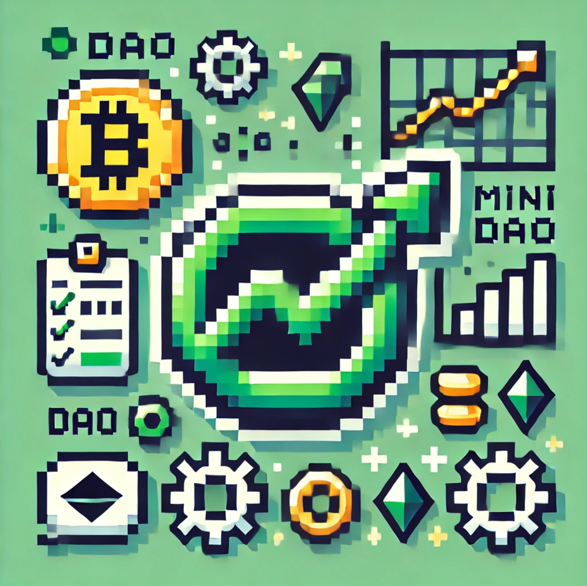
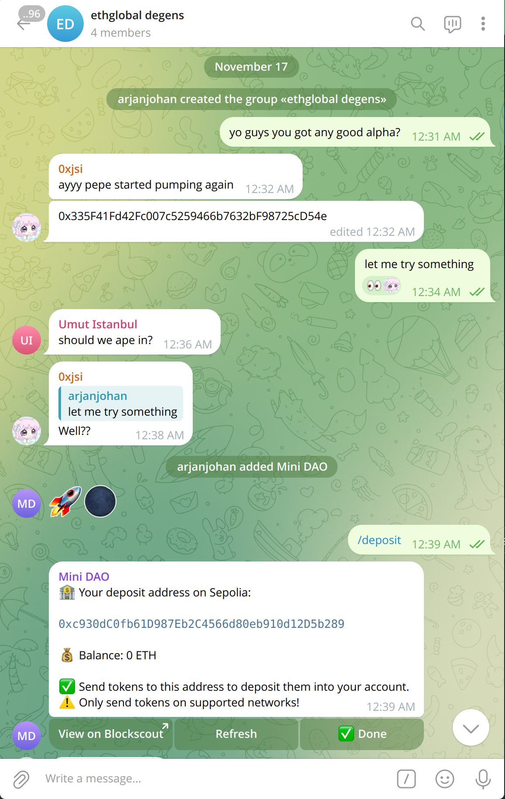
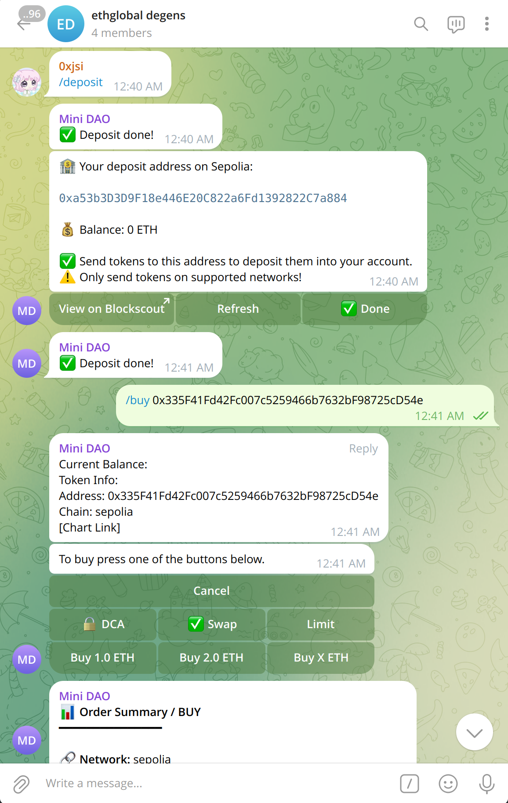
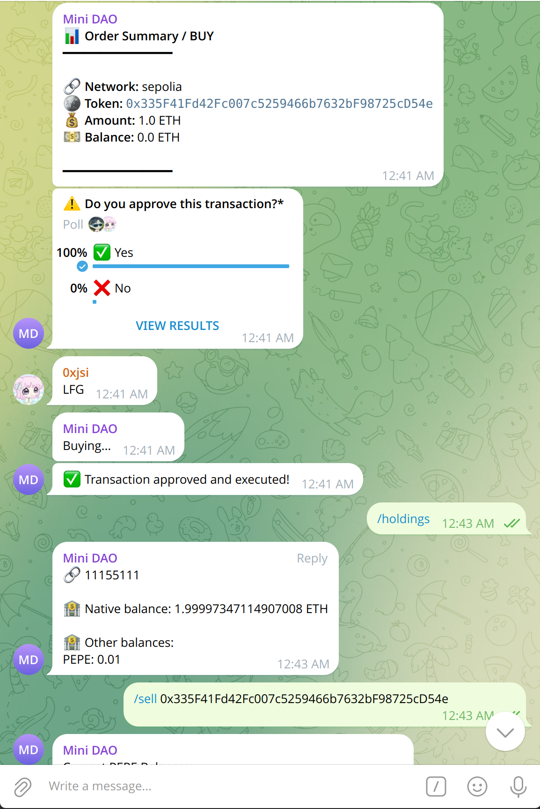
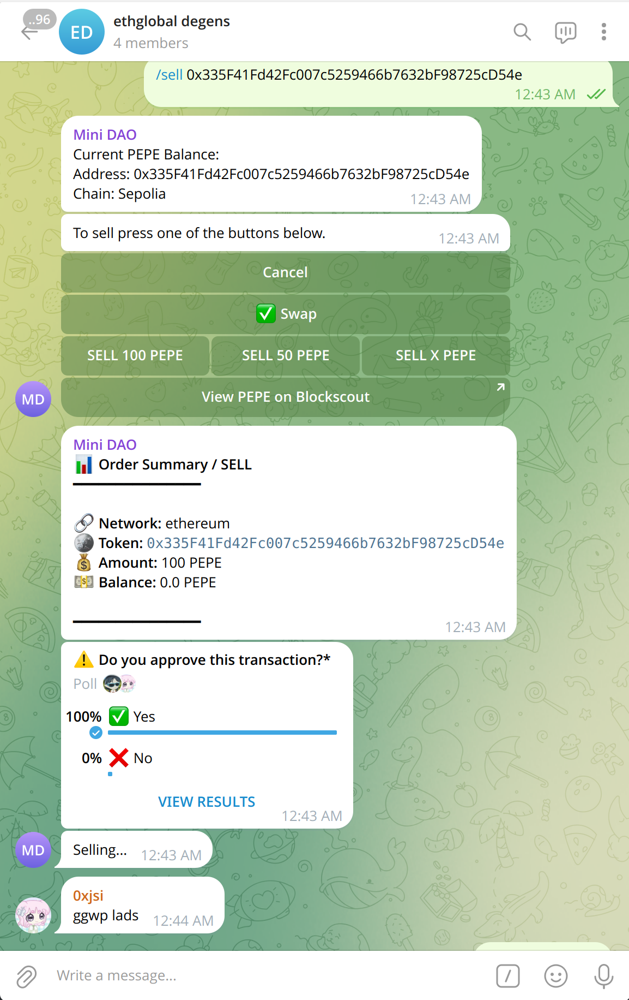

# mini-dao

Mini DAO is a telegram bot that enables DAO's inside of Telegram. Add the bot to your telegram group to get started. The group members can deposit tokens to the bot wallet, and then trade together.

⚙️ Built using Telegram, Curvegrid, Supabase, Telegraph, Drizzle and Solidity  .

- 🗳️ **Quickly create a DAO**: Create a new Telegram group with the bot, or add the bot to your existing group chats. 
- 💗 **Deposit**: Each user has their own deposit address, to keep track of their share in the DAO. We use Circles ?? to do a gasless transaction from the deposit address to the DAO wallet.
- 🏗️ **Cash out**: Users can exit the DAO or withdraw their funds at any time. The users get a % of all tokens in the wallet based on the amount they put in the DAO before.

## Instructions

To get started with mini-dao, follow these steps:

1. **Add the Bot to Your Group**: Invite the [mini-dao bot](https://t.me/mini_dao_bot) to your Telegram group.
2. **Set Up Your DAO**: Follow the on-screen instructions to configure your DAO settings.
3. **Deposit Tokens**: Use your unique deposit address to add tokens to the DAO.
4. **Manage Your DAO**: Use the bot commands to manage and interact with your DAO.

### Telegram commands

Here are the available commands for interacting with mini-dao on Telegram:

- **/start**: Welcome message and list of available commands.
- **/deposit**: Show your personal deposit address. After completing the deposit, click conform to send the deposit to the mini-dao wallet.
- **/block**: Get the latest block number.
- **/buy [contractaddress]**: Buy a token.
- **/sell [contractaddress]**: Sell a token.
- **/holdings**: Check your holdings.
- **/gas**: Get the current gas price.
- **/help**: Show help message with available commands.

## Screenshots

|      Setup              |          Buying      |
| ------------------------------ | ---------------------------- |
|  |  |

| Holdings                   | Selling               |
| ------------------------------- | -------------------------------- |
|  |  |

## Next steps
During EthGlobal we made a simple but working prototype. However, we have big plans for the future of mini-dao. Some of the features we will add:
- Cross-chain swaps
- Leaderboards
- NFT trading

## Links
- [Telegram bot](https://t.me/mini_dao_bot)
- [Presentation slides](https://docs.google.com/presentation/d/1bTkFOcl5JRsd_-CbEslBOMwQQ3WeoVRfyV-QE56iBTY/edit?usp=sharing)
- [Github repo](https://github.com/mini-dao/mini-dao)
- [EthGlobal project page](https://ethglobal.com/showcase/minidao-ahbhs)

## Deployed contracts
- [Mantle](https://explorer.sepolia.mantle.xyz/address/0x7260Fa6a6F79a155C3930E9CBb64fB4ce343B88c)
- [Flare Network](https://coston2-explorer.flare.network/address/0x50302d5C3eBdBd639951a47102168ADA72338DA2)
- [Zircuit](https://explorer.testnet.zircuit.com/address/0xa206C4138004c4D7dfcF8724EEAa8d377935E908)
- [Base](https://base-sepolia.blockscout.com/address/0x894dCB90F178323E5Ee62aEa642774EbFACB4323)
- [Celo](https://celo-alfajores.blockscout.com/address/0xb3870f99F3C41d17b43fEd3D8789E2a0b97a3CF1)
- [Scroll](https://scroll-sepolia.blockscout.com/address/0x0B68EE78502411810b9503ab2F943B7Bd0c08d5A)
- [Polygon](https://cardona-zkevm.polygonscan.com/address/0xbFC3a250ACa9Af6f3399D2056BDB5786f9Ec6b3e)
- [Neon EVM](https://devnet.neonscan.org/address/0x084815d1330ecc3ef94193a19ec222c0c73dff2d)

## Team 
- [arjanjohan](https://x.com/arjanjohan)
- [0xjsi.eth](https://x.com/0xjsieth)
- [nhestrompia.eth](https://x.com/nhestrompia)
- [0xGGE](https://x.com/0xGGE)