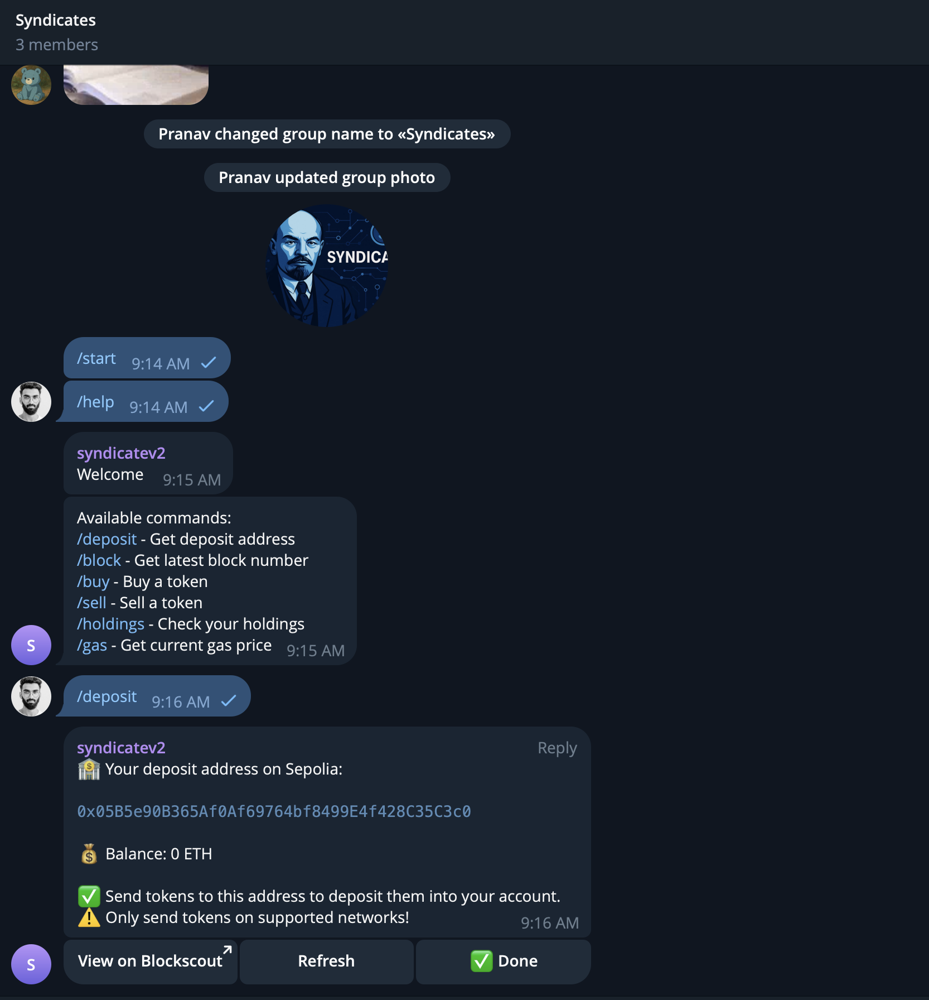

# Syndicates

Syndicates is a Telegram bot that manages token-gated investment communities. Members holding specific ERC-20 membership tokens can join exclusive Telegram groups and participate in collective investment decisions through on-chain voting mechanisms.

⚙️ Built using Next.js, Node.js, Telegram Bot API, Ethereum Sepolia, and Solidity.

- 🔐 **Token-Gated Access**: Only holders of membership tokens can access the investment group
- 🗳️ **Democratic Voting**: Members vote on investment proposals via Telegram inline buttons
- 🚀 **Automatic Execution**: Approved investments are executed automatically via smart contracts
- 📊 **Portfolio Tracking**: Real-time tracking of collective investments and performance

## How It Works

### For Members:

1. **Connect Wallet**: Link your wallet through our Next.js app to verify token holdings
2. **Join Group**: Get access to the exclusive Telegram investment group
3. **Vote on Proposals**: Participate in investment decisions when admins propose new tokens
4. **Track Performance**: Monitor the group's collective portfolio and returns

### For Admins:

1. **Post Proposals**: Submit token contract addresses for investment consideration
2. **Initiate Voting**: Start voting rounds with customizable time windows
3. **Execute Investments**: Automatic execution when vote threshold is met (e.g., >50% approval)

## Key Features

### 🔒 Membership Validation

- Wallet connection via Next.js frontend with RainbowKit/Wagmi
- On-chain verification of ERC-20 token holdings on Ethereum Sepolia
- Automatic Telegram group access management

### 📝 Investment Proposals

- Admins submit token contract addresses via Telegram commands
- Bot automatically fetches token details (symbol, decimals, price)
- Broadcast proposals with voting interfaces

### 🗳️ Voting Mechanism

- Members vote using Telegram inline buttons (✅ / ❌)
- Real-time vote tallying with membership verification
- Configurable voting windows (default: 24 hours)
- Only verified token holders can participate

### 💰 Investment Execution

- Automatic execution when approval threshold is reached
- Smart contract integration for secure fund management
- DEX integration for token swaps on Sepolia testnet
- Transparent transaction history

### 📈 Portfolio Management

- Real-time portfolio tracking and valuation
- Investment allocation breakdown
- Performance analytics and historical data
- Web dashboard and Telegram bot interface

## Commands

### For Members:

- **/connect**: Link your wallet to verify token holdings
- **/portfolio**: View current group investments and performance
- **/vote [proposal_id]**: Cast your vote on active proposals
- **/holdings**: Check your membership token balance
- **/help**: Display available commands

### For Admins:

- **/propose [token_address]**: Submit new investment proposal
- **/start_voting [proposal_id]**: Initiate voting round
- **/results [proposal_id]**: View voting results
- **/execute [proposal_id]**: Manually trigger approved investment

## Screenshots

| Setup                                       | Trading                                     |
| ------------------------------------------- | ------------------------------------------- |
|  |  |

## Architecture

### Frontend

- **Next.js** application for wallet authentication
- **RainbowKit/Wagmi** for Web3 wallet connections
- Dashboard for token holdings and voting history

### Backend

- **Node.js** server with Express framework
- **Telegram Bot API** for group management and voting
- **Ethereum integration** via ethers.js/viem for on-chain operations

### Smart Contracts

- **Membership Token (ERC-20)**: Deployed on Sepolia testnet
- **Investment Executor**: Handles voting logic and automatic execution
- **Portfolio Manager**: Tracks investments and manages collective funds

## Security Features

- ✅ **Verified Linkage**: Secure Telegram ID ↔ Wallet address verification
- ✅ **Rate Limiting**: Protection against command spam and abuse
- ✅ **Multi-sig Security**: Secure handling of investment funds
- ✅ **Testnet First**: Sepolia deployment for safe testing and validation

## Roadmap

### Phase 1 (Current)

- Token-gated membership system
- Basic voting mechanisms
- Sepolia testnet deployment

### Phase 2 (Coming Soon)

- Mainnet deployment with enhanced security
- NFT-gated access options
- Staking-based voting power weights

### Phase 3 (Future)

- Advanced portfolio analytics
- Cross-chain investment capabilities
- Automated investment strategies
- Governance token integration

## Links

- [Telegram bot](https://t.me/syndicatev2_bot)
- [Frontend App](https://syndicates-app.vercel.app) _(Coming Soon)_
- [Github repo](https://github.com/pranavdaa/tg-token-bot)
- [Deployed Contracts](#deployed-contracts)

## Deployed Contracts

### Sepolia Testnet (Live Deployment - Blockscout Verified )

- **Membership Token (SYND)**: [`0x8D386029Beb5415265852a991cfc25dF6f96308C`](https://eth-sepolia.blockscout.com/address/0x8D386029Beb5415265852a991cfc25dF6f96308C)
- **WETH**: [`0x225A965ECB18941351eb239f44ecB0E04a964EF8`](https://eth-sepolia.blockscout.com/address/0x225A965ECB18941351eb239f44ecB0E04a964EF8)
- **Router (DEX)**: [`0x73E2E1E81dFE82016f4F21012EF8F33Ce8B7A1c1`](https://eth-sepolia.blockscout.com/address/0x73E2E1E81dFE82016f4F21012EF8F33Ce8B7A1c1)
- **PEPE/WETH Pair**: [`0xEe3805083CCa3a323599a9b18eA589fFb5e1c6A5`](https://eth-sepolia.blockscout.com/address/0xEe3805083CCa3a323599a9b18eA589fFb5e1c6A5)
- **DOGE/WETH Pair**: [`0xe71Bc8C08D112f829470620D4C56cF2077cC37b3`](https://eth-sepolia.blockscout.com/address/0xe71Bc8C08D112f829470620D4C56cF2077cC37b3)
- **PEPE Token**: [`0xA89A1bE122149d534184a9f729E9Ce072a5bB8Fe`](https://eth-sepolia.blockscout.com/address/0xA89A1bE122149d534184a9f729E9Ce072a5bB8Fe)
- **DOGE Token**: [`0x5b377a7A6B877bCb6F9Ff8220e5C6eb6ecCEA47f`](https://eth-sepolia.blockscout.com/address/0x5b377a7A6B877bCb6F9Ff8220e5C6eb6ecCEA47f)

## Team

- [pranav](https://x.com/impranavm_)
